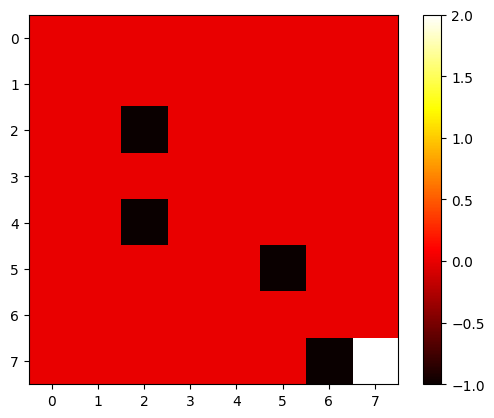

# Reinforcement Learning : Q-Learning Grid World

### Deskripsi Proyek

Proyek ini mendemonstrasikan penggunaan **Q-learning**, sebuah algoritma reinforcement learning, untuk melatih agen dalam dunia grid untuk mencapai tujuan tertentu sambil menghindari rintangan. Dalam simulasi ini, agen belajar melalui trial-and-error, mengupdate kebijakan (policy) berdasarkan feedback yang diterima dari setiap tindakan yang diambil.

### Tujuan Proyek

- Membuat agen yang dapat bergerak dalam grid 8x8.
- Agen belajar untuk mencapai titik tujuan (goal) dengan cara menghindari rintangan yang ada di grid.
- Menggunakan algoritma **Q-learning** untuk mengoptimalkan keputusan yang diambil oleh agen.

### Lingkungan Grid World

- **Ukuran grid**: 8x8 (berisi total 64 sel).
- **Posisi mulai**: `(0, 0)`.
- **Posisi tujuan**: `(7, 7)`.
- **Rintangan**: Ada beberapa rintangan yang ditempatkan di posisi grid yang tidak dapat dilewati oleh agen. Rintangan ini diberi posisi `(2, 2)`, `(4, 2)`, `(7, 6)`, dan `(5, 5)`.

### Algoritma Q-learning

**Q-learning** adalah algoritma reinforcement learning model bebas yang mengoptimalkan kebijakan tanpa memerlukan model dari lingkungan. Ini dilakukan dengan mempelajari tabel Q yang menyimpan nilai dari setiap pasangan status-aksi. Agen memilih aksi berdasarkan nilai Q ini dan mengupdate nilai tersebut setelah setiap langkah berdasarkan reward yang diterima.

1. **Alpha** (learning rate): Mengontrol sejauh mana nilai Q baru menggantikan nilai Q yang lama.
2. **Gamma** (discount factor): Menentukan pentingnya reward di masa depan dibandingkan dengan reward segera.
3. **Epsilon** (exploration rate): Menentukan berapa banyak agen akan mengeksplorasi versus mengeksploitasi kebijakan yang sudah dipelajari.

---

## Penjelasan Kode

Berikut adalah penjelasan kode utama yang digunakan dalam proyek ini.

### 1. **Import Libraries**
   Kita memulai dengan mengimpor beberapa pustaka yang dibutuhkan:

   ```python
   import numpy as np
   import random
   import matplotlib.pyplot as plt
   ```

   - **numpy** digunakan untuk operasi numerik, terutama dalam manipulasi tabel Q.
   - **random** digunakan untuk eksplorasi aksi acak oleh agen.
   - **matplotlib.pyplot** digunakan untuk visualisasi grid dan hasil pelatihan.

### 2. **Membuat Grid dan Pengaturan Lingkungan**
   Berikut adalah bagian kode untuk membuat grid dan pengaturan posisi agen, tujuan, dan rintangan:

   ```python
   grid_size = 8
   start = (0, 0)
   goal = (7, 7)
   obstacles = [(2, 2), (4, 2), (7, 6), (5, 5)]
   actions = [(0, 1), (1, 0), (0, -1), (-1, 0)]
   ```

   - **grid_size**: Menentukan ukuran grid.
   - **start**: Posisi awal agen.
   - **goal**: Posisi tujuan agen.
   - **obstacles**: Daftar posisi yang tidak dapat dilalui oleh agen.

### 3. **Fungsi untuk Membuat dan Menampilkan Grid**
   Fungsi untuk membuat grid dan menampilkan posisi agen serta rintangan:

   ```python
   def create_grid():
       grid = np.zeros((grid_size, grid_size))
       for obstacle in obstacles:
           grid[obstacle] = -1  # Rintangan dilabeli -1
       grid[goal] = 1  # Tujuan dilabeli 1
       return grid
   ```

   - Grid dibuat dengan nilai 0 untuk setiap sel yang kosong.
   - Rintangan diberi nilai -1, dan tujuan diberi nilai 1.

### 4. **Implementasi Algoritma Q-learning**
   Agen menggunakan **Q-learning** untuk memilih tindakan dan memperbarui tabel Q:

   ```python
   class QLearningAgent:
       def __init__(self, grid_size, actions, alpha=0.1, gamma=0.9, epsilon=0.2):
           self.grid_size = grid_size
           self.actions = actions
           self.alpha = alpha
           self.gamma = gamma
           self.epsilon = epsilon
           self.q_table = np.zeros((grid_size, grid_size, len(actions)))  # Tabel Q
           self.position = start

       def choose_action(self):
           if random.uniform(0, 1) < self.epsilon:
               return random.choice(range(len(self.actions)))  # Eksplorasi
           else:
               x, y = self.position
               return np.argmax(self.q_table[x, y])  # Eksploitasi

       def move(self, action_idx):
           action = self.actions[action_idx]
           new_x = self.position[0] + action[0]
           new_y = self.position[1] + action[1]
           new_x = max(0, min(new_x, self.grid_size - 1))
           new_y = max(0, min(new_y, self.grid_size - 1))
           if (new_x, new_y) in obstacles:
               return self.position  # Tetap di posisi lama jika bertabrakan
           return (new_x, new_y)
   ```

   - **choose_action()**: Memilih antara eksplorasi (aksi acak) dan eksploitasi (aksi terbaik berdasarkan tabel Q).
   - **move()**: Memperbarui posisi agen berdasarkan aksi yang diambil.

### 5. **Fungsi Pembaruan Tabel Q**
   Pembaruan tabel Q dilakukan dengan aturan Q-learning setelah agen melakukan tindakan dan menerima reward:

   ```python
   def update_q_table(self, old_position, action_idx, reward, new_position):
       x, y = old_position
       new_x, new_y = new_position
       best_future_q = np.max(self.q_table[new_x, new_y])  # Nilai Q terbaik untuk posisi baru
       self.q_table[x, y, action_idx] += self.alpha * (reward + self.gamma * best_future_q - self.q_table[x, y, action_idx])
   ```

   - Tabel Q diperbarui berdasarkan reward yang diterima dan nilai terbaik di masa depan.

---

## Menjalankan Kode

Untuk menjalankan kode ini, cukup jalankan perintah berikut di terminal:

```bash
git clone https://github.com/<username>/reinforcement-learning-portfolio.git
cd reinforcement-learning-portfolio
jupyter notebook reinforcement_learning_try.ipynb
```

---

### Visualisasi Hasil

Berikut adalah beberapa visualisasi yang dihasilkan dari pelatihan agen:

#### Grid World Agen

Gambar berikut menunjukkan posisi agen, rintangan, dan tujuan di dalam grid:



#### Grafik Kemajuan Pelatihan

Grafik di bawah ini menunjukkan path yang ditempuh agen selama pelatihan:

![Training Progress]
(assets/output.png)
(assets/output2.png)
(assets/output3.png)
(assets/output4.png)
(assets/output5.png)
(assets/output6.png)
(assets/output7.png)
(assets/output8.png)
(assets/output9.png)
(assets/output10.png)
(assets/output11.png)
(assets/output12.png)
(assets/output13.png)
(assets/output14.png)
(assets/output15.png)

---

### Hasil Proyek

Setelah agen dilatih menggunakan Q-learning, agen akan dapat menemukan jalur terbaik untuk mencapai tujuan sambil menghindari rintangan. Visualisasi ini menunjukkan jalur yang dipilih oleh agen untuk mencapai tujuan dari posisi awal `(0, 0)`.

---